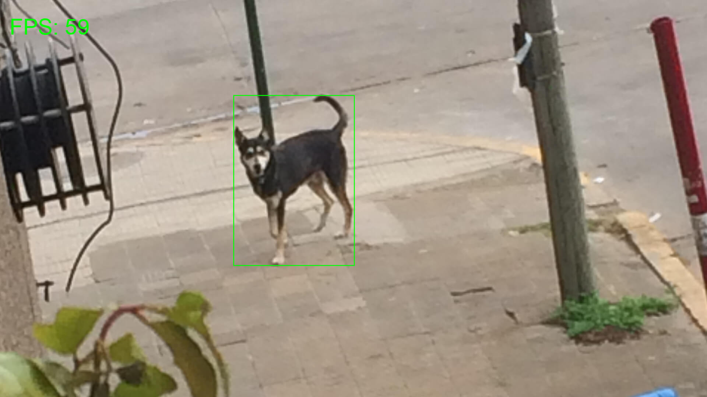

# Python Detection System

This project implements a real-time motion detection system using OpenCV. The system processes frames from a video stream, detects motion, calculates the FPS (frames per second), and handles state changes (motion detected / no motion).


## Technologies Used
<div>
	<a href="https://skillicons.dev">
		
	</a>
</div>


## Requirements

Before running the project, make sure you have the following requirements:

- Python 3.8 or higher
- `pip` to install dependencies
- OpenCV (`cv2`)


## Installation

1. **Clone the repository**:

   ```bash
   git clone https://github.com/FedeHide/python-motion-detector.git
   ```

2. **Create a virtual environment (optional but recommended)**:

    ```bash
    python3 -m venv venv
    source venv/bin/activate  # On Windows use: venv\Scripts\activate
    ```

3. **Install the dependencies**:

    ```bash
    pip install -r requirements.txt
    ```


## Usage:

To run the motion detection system, simply execute the motion_detection_main.py file. This file sets up the camera, processes frames, detects motion, and displays the video in real-time.

```bash
python motion_detection_main.py
```

## Process Details

- **Camera Initialization:** The system starts the camera by default or with the provided index (if you have multiple cameras connected).
- **Frame Processing:** Each video frame is converted to grayscale, and Gaussian blur is applied to reduce noise. Then, the difference between the first frame and the current frames is calculated to detect motion.
- **Motion Detection:** If the difference between frames exceeds a threshold (minimum contour area), the system considers it motion and marks the corresponding area.
- **FPS:** The system calculates FPS in real-time to display the motion detection performance.
- **State Handling:** If the state changes from "no motion" to "motion detected" or vice versa, the time of that change is stored in a list.
- **Exit:** The system will stop execution when you press the q key or an error occurs.

------------


<!--  -->
<div align="center">
  
</div>


## Contribution

See [Contributing Guide](CONTRIBUTING.md).

## License

© 2024-Present by [Fede Hide](https://github.com/FedeHide). Licensed under the MIT License. V1.0.0